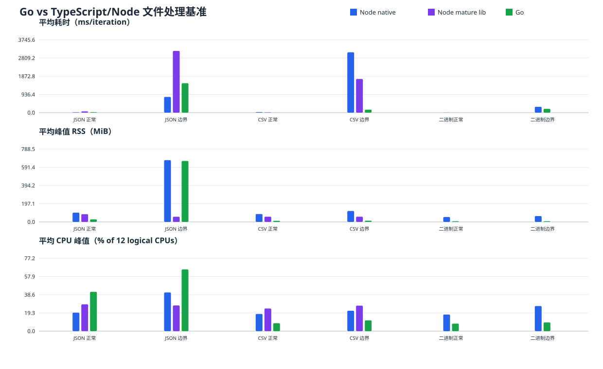

# Go 与 TypeScript（Node.js）文件处理技术选型与性能评估报告

> **测试日期：2026 年 7 月 29 日**。本报告基于当前工作区 `W:\提示词` 的真实业务库样本和同机实测结果，不以理论推测替代基准数据。

## 第一部分：评估报告

### 1. 执行摘要

本次测试覆盖 JSON、CSV、二进制复制/哈希三类常见文件处理，Node.js 同时测试原生实现与成熟库。每个组合冷启动子进程运行 5 次；正常规模使用 20 次迭代以降低进程启动噪声，边界规模使用 1 次迭代。结果显示：Go 在 CSV 和二进制流式处理上明显更快且更省内存，但在 JSON 全量解析上 Node 原生更快，尤其是 130MB 级 JSON；JSONStream 以显著更低 RSS 换取更高耗时。

### 2. 测试环境与测量方法

| 项目 | 配置 |
|---|---|
| 操作系统/硬件 | Windows；GULIACER；Micro-Star International MS-7C94；12 个逻辑处理器；31 GiB RAM |
| Node.js | v24.13.0 |
| Go | go1.26.5 windows/amd64 (portable benchmark runtime)；便携运行时，仅用于基准，不引入项目依赖 |
| Node 方案 | 原生 `fs`/`readline`/stream；JSONStream；csv-parser |
| Go 方案 | 标准库 `encoding/json`、`encoding/csv`、`io.Copy`、`crypto/sha256` |
| 采样 | 每 10ms 采样进程 WorkingSet64 与 TotalProcessorTime；CPU 峰值按 12 个逻辑处理器归一化；RSS 为进程峰值工作集 |
| 重复次数 | 每个场景/实现 5 次；报告值为平均值；原始 80 条记录见 `go-vs-node-file-processing-results.csv` |

CPU 读数是 Windows 进程级采样值，受 10ms 采样粒度和调度影响，适合做相对比较，不应解读为硬件性能计数器的精确峰值。测试没有强制清空 Windows 文件系统缓存，因此结果代表真实桌面环境下的冷启动进程/常规 OS 缓存状态，而不是人为清缓存后的极限冷盘结果。

### 3. 业务数据集与场景

数据源为当前正式包用户数据：`release\win-unpacked\data\library\library.json` 与 `release\win-unpacked\data\library\images\`。原始库包含 1,600 个素材条目、2,247,082 bytes；二进制正常样本来自真实媒体文件。大文件是基于真实记录/真实媒体内容生成的边界扩展集，保留业务字段形态，但不应表述为 100% 原始生产文件。

| 场景 | 文件 | 实际大小 | 业务含义 |
|---|---|---:|---|
| JSON 正常规模 | `json-normal.json` | 2,247,082 bytes (2.14 MiB) | 1600 条真实库记录 |
| JSON 边界规模（真实样本扩展） | `json-large.json` | 129,956,237 bytes (123.94 MiB) | 真实库记录重复扩展，边界压力 |
| CSV 正常规模 | `csv-normal.csv` | 499,545 bytes (0.48 MiB) | 1600 条真实库记录 |
| CSV 边界规模（真实样本扩展） | `csv-large.csv` | 104,892,955 bytes (100.03 MiB) | 真实库记录重复扩展，边界压力 |
| 二进制正常规模 | `binary-normal.bin` | 216,183 bytes (0.21 MiB) | 真实媒体文件复制/校验 |
| 二进制边界规模（真实媒体扩展） | `binary-large.bin` | 134,249,643 bytes (128.03 MiB) | 真实媒体内容扩展至大文件 |

测试操作定义：JSON 读取并解析 `items`；CSV 读取并解析每条记录；二进制从输入流复制到输出并计算 SHA-256。各实现输出记录数/字节数，二进制输出再做 SHA-256 校验，确保功能等价。

### 4. 详细性能数据

#### 4.1 平均耗时、峰值 RSS、CPU 峰值

| 场景 | 实现 | 平均耗时 ms/次 | 平均峰值 RSS MiB | 平均 CPU 峰值 % | 相对 Node 原生耗时 |
|---|---|---:|---:|---:|---:|
| JSON 正常规模 | Node fs + JSON.parse | 17.480 | 99.650 | 19.600 | 基准 |
| JSON 正常规模 | Node JSONStream | 65.193 | 82.815 | 28.400 | 3.73×（慢 273.0%） |
| JSON 正常规模 | Go encoding/json | 25.756 | 27.152 | 41.600 | 1.47×（慢 47.3%） |
| JSON 边界规模（真实样本扩展） | Node fs + JSON.parse | 809.507 | 668.213 | 41.000 | 基准 |
| JSON 边界规模（真实样本扩展） | Node JSONStream | 3174.196 | 55.631 | 27.200 | 3.92×（慢 292.1%） |
| JSON 边界规模（真实样本扩展） | Go encoding/json | 1512.031 | 659.939 | 65.400 | 1.87×（慢 86.8%） |
| CSV 正常规模 | Node fs/readline + 手写解析 | 27.316 | 85.098 | 18.200 | 基准 |
| CSV 正常规模 | Node csv-parser | 13.915 | 56.162 | 24.000 | 0.51×（快 49.1%） |
| CSV 正常规模 | Go encoding/csv | 2.865 | 11.602 | 8.400 | 0.10×（快 89.5%） |
| CSV 边界规模（真实样本扩展） | Node fs/readline + 手写解析 | 3102.618 | 118.085 | 21.600 | 基准 |
| CSV 边界规模（真实样本扩展） | Node csv-parser | 1729.666 | 56.492 | 27.000 | 0.56×（快 44.3%） |
| CSV 边界规模（真实样本扩展） | Go encoding/csv | 151.512 | 13.193 | 11.400 | 0.05×（快 95.1%） |
| 二进制正常规模 | Node stream + SHA-256 | 5.667 | 52.433 | 17.600 | 基准 |
| 二进制正常规模 | Go io.Copy + SHA-256 | 2.589 | 6.668 | 8.000 | 0.46×（快 54.3%） |
| 二进制边界规模（真实媒体扩展） | Node stream + SHA-256 | 298.452 | 62.881 | 26.600 | 基准 |
| 二进制边界规模（真实媒体扩展） | Go io.Copy + SHA-256 | 193.903 | 6.716 | 9.200 | 0.65×（快 35.0%） |



#### 4.2 多轮离散程度

| 场景 | 实现 | 耗时平均 ± 标准差 ms | RSS 平均 ± 标准差 MiB |
|---|---|---:|---:|
| JSON 正常规模 | Node fs + JSON.parse | 17.480 ± 1.873 | 99.650 ± 4.574 |
| JSON 正常规模 | Node JSONStream | 65.193 ± 2.442 | 82.815 ± 1.183 |
| JSON 正常规模 | Go encoding/json | 25.756 ± 2.128 | 27.152 ± 1.916 |
| JSON 边界规模（真实样本扩展） | Node fs + JSON.parse | 809.507 ± 42.700 | 668.213 ± 0.599 |
| JSON 边界规模（真实样本扩展） | Node JSONStream | 3174.196 ± 72.513 | 55.631 ± 0.347 |
| JSON 边界规模（真实样本扩展） | Go encoding/json | 1512.031 ± 46.634 | 659.939 ± 7.360 |
| CSV 正常规模 | Node fs/readline + 手写解析 | 27.316 ± 2.838 | 85.098 ± 4.420 |
| CSV 正常规模 | Node csv-parser | 13.915 ± 0.876 | 56.162 ± 0.413 |
| CSV 正常规模 | Go encoding/csv | 2.865 ± 0.330 | 11.602 ± 3.876 |
| CSV 边界规模（真实样本扩展） | Node fs/readline + 手写解析 | 3102.618 ± 59.454 | 118.085 ± 1.269 |
| CSV 边界规模（真实样本扩展） | Node csv-parser | 1729.666 ± 9.102 | 56.492 ± 0.211 |
| CSV 边界规模（真实样本扩展） | Go encoding/csv | 151.512 ± 15.647 | 13.193 ± 0.112 |
| 二进制正常规模 | Node stream + SHA-256 | 5.667 ± 0.495 | 52.433 ± 1.146 |
| 二进制正常规模 | Go io.Copy + SHA-256 | 2.589 ± 0.320 | 6.668 ± 0.764 |
| 二进制边界规模（真实媒体扩展） | Node stream + SHA-256 | 298.452 ± 18.007 | 62.881 ± 0.496 |
| 二进制边界规模（真实媒体扩展） | Go io.Copy + SHA-256 | 193.903 ± 16.410 | 6.716 ± 0.205 |

### 5. 结果解读

- **JSON 全量解析：保留 Node。** 正常规模 Node `fs + JSON.parse` 为 17.480ms/次，Go 为 25.756ms/次，Go 慢 47.3％；边界规模 Node 为 809.507ms，Go 为 1512.031ms，Go 慢 86.8％。
- **JSON 流式：适合内存约束，不适合追求吞吐。** JSONStream 的边界 RSS 约 55.631MiB，显著低于全量解析，但耗时 3174.196ms，约为 Node 原生的 3.92 倍。
- **CSV：Go 有明显优势。** Go `encoding/csv` 在 105MB 边界文件上平均 151.512ms，比 Node 原生 3102.618ms 快 95.1％；峰值 RSS 约 13.193MiB，低于 Node 原生约 88.8％。
- **二进制流：Go 有稳定优势。** 在 128MiB 级真实媒体扩展文件上，Go 平均 193.903ms，Node 平均 298.452ms，快 35.0％；RSS 6.716MiB 对 62.881MiB，低约 89.3％。
- **成熟 Node 库的代价：** `csv-parser` 相比 Node 原生 CSV 快 44.3％（边界规模），RSS 低 52.2％；JSONStream 相比 Node 原生边界 JSON 慢 292.1％，RSS 低 91.7％。

## 第二部分：综合结论与明确建议

### 6. 结论：不推荐整体替换，保留 TypeScript

**明确建议：不推荐把现有 Electron 文件处理模块整体替换为 Go，保留 TypeScript/Node.js 作为主实现。**

理由不是 Go 没有优势，而是优势集中在 CSV 和二进制流式处理，核心 JSON 场景反而明显落后；同时当前应用的主进程、IPC、日志、缩略图、watcher 和数据模型均已是 TypeScript。整体替换会引入跨语言子进程/IPC、Windows 构建与发布、错误重试、日志串联、调试链路、版本兼容和团队维护成本。依据用户给出的决策逻辑，若只看部分场景 Go 的收益显著，但不足以证明整体迁移的综合收益超过改造成本。

### 7. 可执行的保留 TypeScript 优化方案

1. **JSON 维持原生解析路径**：小/中型库继续 `fs.readFile + JSON.parse`；超大 JSON 仅在确有内存压力时采用按需字段或流式解析，避免默认使用 JSONStream。
2. **CSV 场景先做 TS 内优化**：使用 `createReadStream`、更大的 highWaterMark、复用解析缓冲、避免每行不必要的对象创建；只有当 CSV 是明确的长耗时瓶颈时，才考虑单独抽出 Go helper。
3. **二进制处理优先复用现有并发控制**：限制同时进行的复制/哈希/缩略图任务数，使用流式 pipeline，避免把媒体加载为完整 Buffer；当前 benchmark 只比较单文件吞吐，实际批量效果还要结合磁盘并发度验证。
4. **建立回归基准**：将本次 80 条原始结果、数据生成脚本和 benchmark 作为性能基线；后续每次文件处理优化至少比较平均耗时、P95、峰值 RSS 和失败率。
5. **保留 Go 的局部引入选项**：如果生产监控确认 CSV/二进制处理占总耗时超过约 50%，可以设计窄接口 Go helper 做局部 A/B；不要直接替换 JSON、watcher、缩略图和 IPC 主链路。

### 8. 成本、风险与边界

| 项目 | 评估 |
|---|---|
| 迁移开发 | 整体迁移预计至少 2–4 人周：接口等价、IPC/子进程、错误码、取消/超时、回归测试、Windows 构建；若只做 CSV/二进制 helper，约 3–7 人日，视现有接口复杂度调整。 |
| 运行与部署 | Go 单文件常驻 RSS 较低，但 Electron 仍需携带并管理额外 exe；需处理杀进程、崩溃、临时文件、路径、签名、杀软误报和版本分发。 |
| 维护 | 团队需同时维护 TS 与 Go 两条工具链；调试从 renderer→preload→main→Go 子进程变长，日志和错误上下文更难统一。 |
| 数据兼容 | JSON/CSV 解析器边界行为、Unicode、BOM、换行、转义、异常行、超长字段必须逐项做兼容回归。 |
| 性能风险 | Go 的 CSV/二进制收益会受到 SSD/HDD、并发度、磁盘队列和批处理方式影响；单文件 benchmark 不能直接等价为端到端应用提升。 |
| 结论边界 | 如果后续生产数据表明 CSV/二进制处理成为明确的 CPU/内存瓶颈，建议仅局部引入 Go，并以可回退的 feature flag/A-B 方式上线。 |

### 9. 复现方式与产物

基准源文件：
- `benchmarks/go-vs-node/worker.ts`
- `benchmarks/go-vs-node/main.go`
- `benchmarks/go-vs-node/generate-data.mjs`
- `benchmarks/go-vs-node/run-benchmark.ps1`

复现步骤（Go 运行时仍使用临时目录，不写入项目依赖）：

```powershell
pnpm exec tsc -p benchmarks/go-vs-node/tsconfig.json
# 使用 go1.26.5 windows/amd64 编译 benchmarks/go-vs-node/main.go
node benchmarks/go-vs-node/generate-data.mjs <library.json> <images-dir> <temp-data-dir>
.\benchmarks\go-vs-node\run-benchmark.ps1 -Runs 5 -SampleMs 10
```

原始逐次数据：`docs/go-vs-node-file-processing-results.csv`；图表：`docs/go-vs-node-file-processing-chart.svg`。

