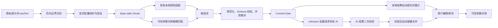

# 智能参数提取方案设计文档

> 版本：v1.1（项目适配优化版）  
> 日期：2026-07-30  
> 状态：方案已收敛，可进入 S0 基线建设与 S1 本地核心实现  
> 适用范围：素言桌面应用（Electron + React + TypeScript + Vite + pnpm）

---

## 1. 结论

原 v1.0 的总体方向是正确的：

- 本地规则优先；
- AI 只处理无法可靠识别的内容；
- 提取结果可追溯；
- 不确定内容不强行归类；
- 通过回归数据持续提升准确率。

但原方案存在明显的首版过度设计，并且与当前项目已经具备的能力有重复：

1. 项目已有约 198 个稳定参数维度、成熟的本地分类规则和参数 Schema，不能再建设一套平行的完整 Parameter Registry；
2. 项目已有 `prompt` AI 分析动作、preload API、IPC 和远程模型调用链路，无须新建一套智能拆分 IPC；
3. 当前参数胶囊以 `{{变量: 值}}` 内嵌在提示词中，另加 `LibraryItem.parameterCapsules` 会形成双重事实源；
4. Embedding、知识图谱、三次 LLM 投票、自动调权、Bloom Filter、Aho-Corasick 和多份知识库文件在现阶段缺少真实数据支撑；
5. 原 68 份分析样例主要用于图片描述、分类和标签词库，并不是带字符区间的参数提取标注集，不能直接作为本功能准确率基线；
6. 远程模型耗时不稳定，不能把“全链路 500ms”作为承诺，应将本地首屏和远程增强分别度量；
7. 原方案先写入再回滚，容易污染状态；应改为“候选收集 → 校验 → 冲突裁决 → 一次性提交”。

因此，本版方案收敛为：

> **复用现有 198 维参数体系，以字符区间安全的本地提取内核为主，接入现有参数词库做可信精确匹配，仅将 unknown 批量交给现有 AI 链路；所有结果在 Commit Gate 前均为候选，不直接修改提示词、分类、标签或词库。**

首个可用版本只需要完成 S0～S2，不依赖 AI 即可交付。S3 是可选增强，Embedding 等高级能力只有在真实指标证明有必要时才进入评估。

---

## 2. 当前项目实际基础

本方案不是从零建设，必须直接复用以下现有能力。

### 2.1 已有参数定义与本地解析

| 现有能力 | 项目位置 | 本方案中的用途 |
|---|---|---|
| `PromptSplitSectionKey` | `src/features/library/utils/promptSplit.ts` | 参数维度唯一键集合 |
| `promptSectionMeta` | `src/features/library/utils/promptSplit.ts` | 参数标题、顺序和展示元数据 |
| `splitPromptToTemplate` | `src/features/library/utils/promptSplit.ts` | 现有本地拆分入口，复用其成熟规则 |
| `resolvePromptSectionKeyForValue` | `src/features/library/utils/promptSplit.ts` | 已知值反查参数维度 |
| `normalizePromptSectionValue` | `src/features/library/utils/promptSplit.ts` | 值标准化 |
| `promptParameterSchema.ts` | `src/features/library/utils/promptParameterSchema.ts` | 稳定 Schema 和维度合法性校验 |
| `analyzePromptText` | `src/features/library/utils/promptAnalysis.ts` | 现有分析结果构建 |
| `buildPromptAnalysisFromSavedCapsules` | `src/features/library/utils/promptAnalysis.ts` | 已保存胶囊恢复 |
| 负向提示词辅助函数 | `src/features/library/utils/promptAnalysis.ts` | 正负向边界隔离 |

`promptSplit.ts` 已经是大体量、高规则密度文件。新能力不得继续无边界地堆入该文件，应通过小型适配层复用其结果，并将 span、证据、冲突裁决放到独立模块。

### 2.2 已有参数胶囊与词库

当前稳定事实源为：

- 提示词正文中的 `{{变量: 值}}`；
- `PromptLexiconSettings.parameters` 中用户确认过的参数词；
- 当前详情页保存逻辑；
- 分类、标签和参数分析统一遵守 15 项结果上限，并保持已有顺序。

本方案不得在 S1～S3 新增 `LibraryItem.parameterCapsules`。否则会出现正文胶囊与结构化字段不一致、迁移复杂、旧数据兼容不明确等问题。

### 2.3 已有 AI 调用链路

项目已经具备：

- `AiFeatureAction` 中的 `prompt`；
- `AiAnalyzeTarget` 中的 `prompt`；
- `window.suyanApi.analyzePromptWithAi`；
- `ai:analyze-prompt` IPC；
- 主进程远程 AI 服务与 JSON 结果解析；
- 详情页“参数分析”动作和本地/远程结果标识。

因此 S3 不新增 `prompt-smart-split` 动作、不新增独立 IPC 通道，也不新增第二套远程客户端，只扩展现有 `prompt` 请求的可选 unknown 上下文和返回约束。

### 2.4 已有测试数据的边界

`tests/fixtures/analysisCases` 中已有约 68 个案例，但这些案例没有完整标注：

- 参数键；
- 原始值；
- `sourceText`；
- 原文 `start/end`；
- 不应提取项；
- unknown；
- 正负向边界。

它们可以作为领域词汇、分类污染和兼容性辅助测试，不能替代专用参数提取金标集。

---

## 3. 目标与非目标

### 3.1 S0～S3 目标

1. 从普通提示词中提取可编辑参数胶囊；
2. 恢复已有显式胶囊，并保证 100% 不丢失；
3. 每个提取项保留原文证据和精确字符区间；
4. 复用当前 198 维参数 Schema，不产生非法维度；
5. 本地结果优先显示，AI 不阻塞本地首屏；
6. AI 仅处理本地 unknown，且一次批量请求；
7. AI 失败时完整保留本地结果；
8. 只有用户确认保存的参数才进入可信词库；
9. 不污染分类词库、标签词库和原图/素材数据；
10. 具备可自动运行的准确率、性能和回归基线。

### 3.2 明确非目标

S0～S3 不做：

- 新账号或云同步；
- 远程数据库；
- Embedding 向量库；
- 知识图谱；
- 三次 LLM 采样投票；
- 自动权重学习；
- 自动把 AI 结果写入可信词库；
- 多套参数 Schema 并存；
- 流式 IPC；
- 复杂插件体系；
- 脱离当前详情页的新编辑器；
- 以正式包目录硬编码 `data/library` 路径。

---

## 4. 核心设计原则

### P1：单一 Schema

`PromptSplitSectionKey + promptSectionMeta + promptParameterSchema` 是参数维度的唯一事实源。新增模块只能补充提取信息，不能复制完整维度表。

### P2：原文与规范化文本双轨

- `rawText`：用于展示、保存和字符区间；
- `normalizedText`：仅用于比较、查词和规则判断。

禁止在定位字符区间前对整段原文执行会改变长度的操作，例如：

- 全局 trim；
- 连续空白压缩；
- `-` 替换为空格；
- Unicode 兼容分解；
- 大小写转换后再反推位置。

### P3：候选先行，一次提交

规则、词库和 AI 只生产候选。候选必须通过统一 Commit Gate 后才能成为最终胶囊。不得先写入状态再回滚。

### P4：自动展示不等于自动学习

系统可以自动展示高置信结果，但只有用户保存、编辑确认或主动选择的参数，才允许进入 `PromptLexiconSettings.parameters`。

### P5：本地结果不等待远程

点击“参数分析”后：

1. 同步或微任务执行本地分析；
2. 立即显示本地胶囊和 unknown；
3. 配置允许时，再后台批量请求 AI；
4. AI 返回后仅增量合并仍然有效的 unknown。

### P6：默认拒绝错误归类

无法满足 Schema、证据、边界、冲突和置信度要求的候选进入 unknown，不强行提取。

---

## 5. 总体架构



---

## 6. 数据模型

### 6.1 字符区间

```ts
export interface TextSpan {
  /** JavaScript UTF-16 code unit offset，含 start，不含 end */
  start: number;
  end: number;
}
```

字符区间必须满足：

```ts
rawText.slice(span.start, span.end) === sourceText
```

S1 不尝试转换为 Unicode code point 索引，统一采用 JavaScript 字符串原生的 UTF-16 offset，避免前后端定义不一致。

### 6.2 候选参数

```ts
export type SmartSplitCandidateSource =
  | "explicit-capsule"
  | "local-rule"
  | "trusted-lexicon"
  | "remote-ai";

export interface SmartSplitCandidate {
  id: string;
  key: PromptSplitSectionKey;
  rawValue: string;
  normalizedValue: string;
  sourceText: string;
  span: TextSpan;
  source: SmartSplitCandidateSource;
  confidence: number;
  evidence: string[];
}
```

### 6.3 最终胶囊

```ts
export interface SmartSplitCapsule extends SmartSplitCandidate {
  status: "accepted";
}
```

### 6.4 unknown

```ts
export interface SmartSplitUnknown {
  id: string;
  sourceText: string;
  span: TextSpan;
  reason:
    | "no-candidate"
    | "low-confidence"
    | "schema-rejected"
    | "conflict"
    | "negative-section"
    | "invalid-value";
  candidateKeys?: PromptSplitSectionKey[];
}
```

### 6.5 一次分析结果

```ts
export interface SmartSplitResult {
  rawText: string;
  capsules: SmartSplitCapsule[];
  unknowns: SmartSplitUnknown[];
  negativeText?: string;
  diagnostics: {
    localDurationMs: number;
    candidateCount: number;
    committedCount: number;
    unknownCount: number;
  };
}
```

结果对象是会话态证据，不作为新的素材持久化字段。最终保存仍走现有胶囊正文和词库逻辑。

---

## 7. 八阶段 Pipeline

### 阶段 0：识别正负向边界

优先复用 `promptAnalysis.ts` 中已有负向提示词逻辑。

要求：

- 正向区域参与参数提取；
- 负向区域保持原样并进入独立字段；
- 除非未来有专门的负向参数 Schema，否则不得把负向词提取为正向胶囊；
- 已有显式胶囊即使靠近负向边界，也按其真实位置处理。

### 阶段 1：保护并恢复显式胶囊

识别 `{{变量: 值}}`：

1. 使用现有参数定义解析变量名；
2. 合法时创建最高优先级候选；
3. 记录完整胶囊区间和内部值区间；
4. Chunk 阶段不得再次拆分该范围；
5. 非法变量名或空值不静默吞掉，保留原文并报告 unknown/诊断。

显式胶囊优先级最高，但仍需做安全校验，不允许远程返回或旧数据创造新的 Schema key。

### 阶段 2：Span-safe Chunk

Chunk 的目的只是缩小候选范围，不负责最终分类。

优先边界：

- 换行；
- 中英文逗号、分号；
- 句号；
- 已知提示词连接符；
- 显式胶囊边界；
- 局部短语内部的空白。

每个 Chunk 必须携带原文 `start/end`。规范化文本单独计算：

```ts
interface PromptChunk {
  rawText: string;
  normalizedText: string;
  span: TextSpan;
}
```

不建议首版进行过度分词。对于 `soft natural window light` 这类短语，应保留完整 Chunk，同时允许本地规则在 Chunk 内产生多个不重叠候选。

### 阶段 3：复用现有本地规则

本阶段不重写 198 维分类器，而是为现有 `promptSplit.ts` 增加最小可复用出口，或通过适配器调用其候选逻辑。

建议从现有实现中抽取/导出：

```ts
export interface PromptSectionCandidate {
  key: PromptSplitSectionKey;
  value: string;
  confidence: number;
  reasons: string[];
}

export function classifyPromptFragmentToCandidates(
  fragment: string,
): PromptSectionCandidate[];
```

约束：

- 现有 `splitPromptToTemplate` 行为保持兼容；
- 新 API 只暴露候选，不改变旧调用方输出；
- 原有关键词、正则、优先级和冲突规则不复制到新文件；
- 新适配层负责把候选映射回 Chunk 内的实际字符区间。

### 阶段 4：可信参数词库精确匹配

数据来源只使用现有 `PromptLexiconSettings.parameters` 中已被用户确认的值。

首版索引：

```ts
Map<NormalizedValue, TrustedLexiconEntry[]>
```

其中：

```ts
interface TrustedLexiconEntry {
  key: PromptSplitSectionKey;
  value: string;
}
```

匹配规则：

1. 优先最长值；
2. 相同值映射多个 key 时不自动提交，交给冲突裁决；
3. 英文匹配考虑词边界，避免子串误命中；
4. 中文匹配按原文范围定位；
5. 命中显式胶囊内部或已被更高优先级候选占用的区间时跳过；
6. 词库项的 key 必须仍然存在于当前 Schema。

不预先引入 Bloom Filter、Trie 或 Aho-Corasick。只有在真实 5 万词性能测试不达标时，再选择 Trie/自动机优化最长匹配。

### 阶段 5：规范化、校验与冲突裁决

处理顺序固定为：

1. key 合法性；
2. 值规范化；
3. 空值、长度和危险内容校验；
4. `sourceText` 与 span 一致性；
5. 正负向区域校验；
6. 重复候选合并；
7. 重叠范围裁决；
8. 同值多 key 冲突裁决；
9. 置信度门槛判断；
10. Commit Gate。

建议优先级：

```text
explicit-capsule > trusted-lexicon > local-rule > remote-ai
```

该优先级不是无条件覆盖。低质量词库项不得压过明确的本地 Schema 约束；任何来源都不能绕过 Validator。

### 阶段 6：unknown 批量 AI 增强

仅在以下条件全部满足时调用 AI：

- 用户已启用远程 AI；
- 存在 unknown；
- 当前分析请求仍有效；
- unknown 未被用户手动处理；
- unknown 不属于负向区域；
- 不包含已接受的显式胶囊。

一次请求发送全部 unknown，不逐词调用。请求中只提供完成分类所需的最小上下文：

```ts
interface PromptUnknownBatch {
  requestId: string;
  promptContext: string;
  unknowns: Array<{
    id: string;
    sourceText: string;
    before?: string;
    after?: string;
    candidateKeys?: PromptSplitSectionKey[];
  }>;
  allowedKeys: PromptSplitSectionKey[];
}
```

远程返回：

```ts
interface PromptUnknownBatchResult {
  requestId: string;
  items: Array<{
    id: string;
    key: PromptSplitSectionKey | null;
    normalizedValue?: string;
    confidence: number;
    reason?: string;
  }>;
}
```

远程结果必须二次经过本地 Schema、值、span、冲突和置信度校验。AI 不提供原文 offset，本地使用请求中的 unknown id 恢复证据，避免模型伪造位置。

默认只调用一次，temperature 建议为 `0～0.2`。不默认使用三次采样；只有真实冲突数据证明一次调用不稳定时，才对极少数冲突项追加一次确认。

### 阶段 7：最终合并与受控学习

合并要求：

- 保留当前已有胶囊顺序；
- 新胶囊按原文位置追加；
- 相同 key + 规范化值不重复；
- 遵守项目分类、标签、参数统一最多 15 项的产品约束；
- 超出上限的候选保持 unknown，不生成逐项“接受/忽略”操作，也不静默覆盖已有项；
- AI 返回时，如果用户已经修改提示词或发起新请求，丢弃旧结果；
- AI 失败只显示明确提示，不清空本地结果。

学习要求：

- 用户保存后，确认过的参数值可进入现有参数词库；
- 用户删除或修正的自动提取结果不得把原始错误值写入可信词库；
- 参数词不得写入分类或标签词库；
- 不新增后台“自进化”任务。

---

## 8. 提取 Overlay，而不是第二套 Registry

现有 Schema 已经解决“有哪些参数维度”。新模块只补充“如何安全提取”。

建议结构：

```ts
interface ParameterExtractionOverlay {
  key: PromptSplitSectionKey;
  aliases?: string[];
  valuePolicy?: "free-text" | "enum-like" | "numeric";
  validators?: Array<(value: string) => boolean>;
  conflictsWith?: PromptSplitSectionKey[];
}
```

规则：

1. Overlay 只登记确有额外需求的维度；
2. 未登记的维度仍可走现有规则和词库；
3. 标题、排序、展示名不在 Overlay 重复定义；
4. 测试必须验证 Overlay 中的 key 全部属于当前 Schema；
5. Overlay 不允许远程配置动态新增维度。

首版预计只需为容易混淆或需要数值校验的少量维度配置 Overlay，而不是复制约 198 个定义。

---

## 9. 置信度与 Commit Gate

### 9.1 初始门槛

置信度用于排序和门控，不进行未经数据验证的复杂加权学习。

建议初始值：

| 来源 | 初始置信度 |
|---|---:|
| 合法显式胶囊 | 1.00 |
| 唯一可信词库精确命中 | 0.98 |
| 本地强规则唯一命中 | 0.92 |
| 本地弱规则或多候选 | 0.65～0.85 |
| AI 唯一合法返回 | 最高按 0.80 计入 |

建议门槛：

- `>= 0.75`：在通过 Schema、span、负向隔离、重复和冲突校验后自动提交；
- `< 0.75`：保持 unknown；
- 同区间同优先级的多 key 歧义、低置信、非法值和超限项均保持 unknown，不要求用户逐项确认。

具体值必须在 S0 金标集上校准，不把这些数字当作永久真理。

### 9.2 Commit Gate 必须同时满足

- key 在稳定 Schema 中；
- 值通过规范化和 Validator；
- span 合法且与 `sourceText` 完全一致；
- 不位于负向区域；
- 不与更高优先级候选发生不可解冲突；
- 不与已有胶囊重复；
- 不超过 UI 合并策略允许的数量；
- 当前请求版本仍有效。

不满足时进入 unknown，不修改编辑态正文，也不生成“接受/忽略”确认队列。

---

## 10. UI 接入方案

### 10.1 复用现有入口

继续使用 `PromptDetailDialog.tsx` 现有“参数分析”入口，不增加第二个语义相近按钮。

由于该组件已经较大，新增流程应抽成 Hook：

```ts
useSmartPromptSplit()
```

Hook 负责：

- 本地分析；
- 请求版本号；
- AI 请求状态；
- 旧请求丢弃；
- 结果合并；
- 取消/卸载清理；
- 错误状态。

组件只负责展示和触发，避免继续扩大单文件复杂度。

### 10.2 交互顺序

1. 用户点击参数分析；
2. 本地候选通过 Commit Gate 后立即自动写成胶囊，不出现逐项“接受/忽略”；
3. unknown 仅以灰色原文提示显示，不提供确认按钮；
4. 未达到 15 项上限且存在 unknown 时，才显示“正在增强识别”，但不遮挡本地结果；
5. AI 返回项通过同一套本地二次校验后自动增量写成胶囊；
6. 用户仍可通过现有胶囊编辑器修改或删除自动结果；
7. 保存时仍走现有提示词胶囊逻辑，可信词库学习不得依赖独立确认队列。

### 10.3 状态定义

```ts
type SmartSplitUiStatus =
  | "idle"
  | "local-running"
  | "local-ready"
  | "remote-running"
  | "ready"
  | "remote-failed";
```

AI 失败不是整体失败。`remote-failed` 必须同时保留 `local-ready` 的可用结果。

### 10.4 防止异步覆盖

每次分析生成递增 `requestId` 或版本号。以下情况必须丢弃远程返回：

- 用户修改了提示词；
- 用户关闭详情页；
- 用户重新触发分析；
- 当前素材发生切换；
- 返回的 `requestId` 与活动请求不一致。

S3 可先实现逻辑取消和旧结果丢弃，不要求首版实现底层网络中断。

---

## 11. IPC 与安全边界

### 11.1 S1～S2

纯本地分析应尽量运行在渲染层纯函数中，因为它：

- 不访问文件系统；
- 不访问系统剪贴板；
- 不需要 Node.js；
- 便于单元测试；
- 可以复用现有前端参数定义。

如性能测试证明会阻塞 UI，再评估 Web Worker；不因假设提前引入 Worker 或 IPC。

### 11.2 S3

复用现有链路：

```text
Renderer
  -> window.suyanApi.analyzePromptWithAi
  -> preload 白名单
  -> ai:analyze-prompt
  -> main AI service
  -> remote client
```

要求：

- 渲染进程不得直接访问 `ipcRenderer`；
- 不新增直接 Node.js 能力；
- IPC 继续返回结构化 `IpcResult`；
- 输入限制总长度、unknown 数量和单项长度；
- 远程只可返回 `allowedKeys` 中的 key；
- 错误信息可理解但不包含密钥、请求头或完整响应；
- API Key 继续由现有安全链路管理。

### 11.3 首版不做流式 IPC

一次 unknown 批量请求的结果规模较小，流式通信会额外引入：

- 分片协议；
- 并发请求隔离；
- 取消；
- 监听器清理；
- 页面销毁后的事件泄漏；
- 中间状态冲突。

因此 S3 使用一次请求、一次响应。未来确需流式时，必须同时设计 `requestId`、取消、超时、清理和 stale result 防护，不能只增加进度事件。

---

## 12. 数据存储与隐私

### 12.1 持久化边界

S0～S3 不新增以下文件：

- `parameter-registry.json`；
- `knowledge-graph.json`；
- `embedding-cache.json`；
- `weight-history.json`；
- `llm-votes.json`。

持久化继续复用：

- 提示词正文中的显式胶囊；
- `PromptLexiconSettings.parameters`；
- 现有 View Settings 原子写入机制；
- 现有用户数据目录解析。

### 12.2 路径规则

任何主进程持久化如未来确有必要，必须通过项目现有 app storage/userData 路径工具解析：

- 开发模式：`%APPDATA%\SuYan`；
- 安装版/便携版：软件目录 `data\`；
- 素材库：`data\library\`；
- 日志：软件目录 `logs\`。

禁止在业务模块中硬编码 `data/library` 或继续把正式包数据写到 AppData。

### 12.3 诊断日志

只记录脱敏诊断：

```ts
{
  promptHash,
  promptLength,
  chunkCount,
  candidateCount,
  committedCount,
  unknownCount,
  sourceCounts,
  localDurationMs,
  remoteDurationMs,
  remoteStatus
}
```

不得默认记录：

- 完整提示词；
- 完整 AI 请求/响应；
- API Key；
- 用户本地文件路径；
- 图片内容；
- 未脱敏错误堆栈中的敏感字段。

本功能不增加云端遥测。

---

## 13. 性能方案

### 13.1 分开度量本地和远程

不能使用单一“全链路 500ms”目标，因为远程网络与模型响应不可控。

本地目标：

| 场景 | 目标 |
|---|---:|
| 20 个以内 Chunk 的本地分析 P95 | ≤ 50ms |
| 点击后首批结果可见 | ≤ 100ms |
| 5 万可信词条索引构建 | ≤ 100ms |
| 5 万可信词条单次精确查询 | ≤ 5ms |
| UI 主线程单次连续阻塞 | 尽量 ≤ 16ms，超过时分片 |

远程目标单独统计：

- 请求构建耗时；
- 网络/模型耗时；
- 解析和二次校验耗时；
- 超时率；
- AI 增益率。

### 13.2 优化顺序

只有基准失败时才依次考虑：

1. 缓存规范化值；
2. `Map` 索引复用；
3. 按首字符/语言分桶；
4. 分片执行避免长任务；
5. Trie 或 Aho-Corasick；
6. Web Worker。

不得在无基准数据时直接引入复杂数据结构。

---

## 14. 测试与质量基线

### 14.1 先建设专用金标集

新增：

```text
tests/fixtures/smartSplitCases/
```

S0 首批 30～50 个高质量案例，每个案例至少包含：

```ts
interface SmartSplitFixture {
  id: string;
  prompt: string;
  expected: Array<{
    key: PromptSplitSectionKey;
    value: string;
    sourceText: string;
    start: number;
    end: number;
  }>;
  expectedUnknowns?: string[];
  mustNotExtract?: string[];
  negativeText?: string;
  notes?: string[];
}
```

案例必须覆盖：

- 中文、英文、中英混排；
- 已有显式胶囊；
- 同义表达；
- 复合短语；
- 多个参数连续出现；
- 相同词映射多个维度；
- 负向提示词；
- 标点与换行；
- emoji 和代理对字符；
- 重复值；
- 空白与大小写差异；
- 非参数自然语言；
- 恶意或异常超长输入；
- 参数统一上限 15，并覆盖超过 8 个可靠参数时无需确认即可自动提交；
- 当前容易污染分类/标签词库的参数词。

现有 68 案例用于补充领域词汇和污染回归，不作为 span 精度的唯一基线。

### 14.2 单元测试

建议新增：

```text
src/features/library/utils/smartSplit/__tests__/chunkPrompt.test.ts
src/features/library/utils/smartSplit/__tests__/localCandidateAdapter.test.ts
src/features/library/utils/smartSplit/__tests__/trustedLexiconIndex.test.ts
src/features/library/utils/smartSplit/__tests__/commitSmartSplitCandidates.test.ts
src/features/library/utils/smartSplit/__tests__/runLocalSmartSplit.test.ts
```

重点断言：

- `rawText.slice(start, end) === sourceText`；
- 显式胶囊 100% 恢复；
- 负向词不进入正向参数；
- 非法 key 0 接受；
- 重叠候选按规则裁决；
- 同值同 key 不重复；
- 旧 `splitPromptToTemplate` 行为不回归；
- 词库多 key 冲突不会自动提交；
- AI key 不在 allowlist 时被拒绝；
- stale AI 结果不会覆盖当前编辑态。

### 14.3 UI/集成回归

至少覆盖：

1. 点击后先出现本地结果；
2. AI 关闭时功能完整可用；
3. AI 超时/报错时本地结果仍在；
4. AI 返回前修改提示词，旧结果被丢弃；
5. 原有胶囊顺序保持，新结果追加；
6. 超过 8 个时不覆盖原有胶囊；
7. 参数保存后只进入参数词库；
8. 分类、标签词库不被参数结果污染；
9. 保存再打开后，显式胶囊恢复一致。

### 14.4 量化验收指标

S1～S2 基线：

| 指标 | 验收值 |
|---|---:|
| 本地自动接受 Precision | ≥ 95% |
| 本地 Recall | ≥ 85% |
| 显式胶囊恢复率 | 100% |
| span 精确匹配率 | 100% |
| 负向区域泄漏数 | 0 |
| 非法 Schema key 接受数 | 0 |
| 重复胶囊数 | 0 |
| 分类/标签词库污染数 | 0 |
| 20 Chunk 本地分析 P95 | ≤ 50ms |
| 本地首批结果可见 | ≤ 100ms |

S3 AI 增强指标：

| 指标 | 说明 |
|---|---|
| unknown reduction | AI 合法减少的 unknown 比例 |
| auto-applied precision | AI 结果经本地校验后自动提交的准确率 |
| correction/edit rate | 自动结果被用户删除或修改的比例 |
| invalid-key rate | 必须为 0 |
| stale merge count | 必须为 0 |
| remote timeout/failure rate | 单独统计，不影响本地可用性 |

AI 是否值得保留，以真实增益和用户接受率为准，而不是以模型“看起来更智能”为准。

---

## 15. Sprint 交付计划

### S0：基线与兼容契约（必须先做）

目标：先定义“正确”，避免边实现边改口径。

交付：

- `smartSplitCases` 首批 30～50 个金标案例；
- fixture 类型和读取工具；
- Precision/Recall/span/negative 统计脚本或测试辅助；
- 现有 `splitPromptToTemplate` 关键行为快照；
- 详情页现有胶囊顺序、上限和词库边界回归测试。

退出条件：

- 金标数据评审完成；
- 当前实现基线可重复运行；
- 指标计算口径固定。

### S1：本地提取内核

目标：构建不依赖 UI、IPC 和 AI 的纯函数能力。

交付：

- span-safe Chunk；
- 显式胶囊保护；
- 现有规则候选适配器；
- 提取 Overlay；
- Validator、去重、冲突裁决和 Commit Gate；
- 本地结果与诊断；
- 单元测试与性能基准。

退出条件：

- 达到本地 Precision、Recall、span、负向隔离指标；
- 现有 promptSplit 回归通过。

### S2：可信词库与 UI 本地优先接入

目标：不依赖 AI 交付可用版本。

交付：

- `PromptLexiconSettings.parameters` 索引；
- `useSmartPromptSplit`；
- 接入现有参数分析按钮；
- 本地结果自动提交并展示，unknown 只作只读提示；
- 保持现有胶囊顺序和统一 15 项上限；
- 不提供逐项“接受/忽略”，用户通过现有胶囊编辑能力纠错；
- UI/集成测试。

退出条件：

- AI 完全关闭时功能可用；
- 不污染分类/标签词库；
- 保存与再次打开一致。

### S3：现有 AI 链路的 unknown 批量增强

目标：提高 Recall，不降低本地稳定性。

交付：

- 扩展现有 `prompt` AI 请求，加入可选 unknown batch；
- 主进程最小上下文构造；
- 一次批量请求；
- allowlist 和二次校验；
- requestId/stale result 防护；
- AI 失败降级；
- AI 增益指标。

退出条件：

- invalid-key 和 stale merge 为 0；
- AI 失败不影响本地结果；
- AI 自动提交准确率达到产品可接受水平。

### S4：仅在数据证明需要时评估

候选项：

- Trie/Aho-Corasick；
- Web Worker；
- Embedding 召回；
- 二次 AI 冲突确认；
- 独立候选词配置文件；
- 更细粒度的用户反馈统计。

进入条件必须是：

- 已有足够真实样本；
- 当前指标明确暴露瓶颈；
- 复杂方案能给出可量化收益；
- 不破坏本地存储、隐私和现有 Schema 边界。

知识图谱、自动调权和默认三次 LLM 投票不进入当前路线图。

---

## 16. 文件级落点

### 16.1 S0～S1 新增

```text
src/features/library/types/smartSplit.ts
src/features/library/utils/smartSplit/chunkPrompt.ts
src/features/library/utils/smartSplit/localCandidateAdapter.ts
src/features/library/utils/smartSplit/extractionRegistry.ts
src/features/library/utils/smartSplit/commitSmartSplitCandidates.ts
src/features/library/utils/smartSplit/runLocalSmartSplit.ts

tests/fixtures/smartSplitCases/*.json
```

测试放在对应 `__tests__` 目录。

### 16.2 S1 修改

```text
src/features/library/utils/promptSplit.ts
src/features/library/utils/promptParameterSchema.ts
src/features/library/utils/promptAnalysis.ts
```

修改原则：只暴露必要能力、保持旧行为兼容，不在 `promptSplit.ts` 内继续堆积完整新 Pipeline。

### 16.3 S2 新增/修改

```text
src/features/library/hooks/useSmartPromptSplit.ts
src/features/library/utils/smartSplit/buildTrustedLexiconIndex.ts
src/features/library/components/PromptDetailDialog.tsx
```

实际详情页路径以仓库现状为准；实现前通过引用搜索确认，不凭文档路径直接创建重复组件。

### 16.4 S3 新增/修改

```text
electron/main/ai/smartSplitAiAdapter.ts
```

并最小修改现有：

```text
AI shared types
preload 暴露类型（若请求类型变化）
ai:analyze-prompt handler/service
remote AI client 的 prompt 分支
useSmartPromptSplit.ts
```

不新增第二个 AI 客户端或第二套 IPC。

### 16.5 预计规模

S0～S3 预计新增核心文件约 8～12 个，而不是一次新增数十个服务、存储和图结构文件。优先保持小模块、纯函数、可测试、可删除。

---

## 17. 风险与降级策略

| 风险 | 预防 | 降级 |
|---|---|---|
| span 因规范化错位 | raw/normalized 双轨；强制 slice 断言 | 候选转 unknown |
| 现有规则复用困难 | 先抽取候选出口，保留旧 API | 适配 `splitPromptToTemplate` 输出，不复制规则 |
| 词库历史数据错误 | 多 key 冲突不自动提交；Schema 校验 | 仅本地规则结果 |
| AI 返回非法维度 | allowedKeys + 本地二次校验 | 丢弃非法项 |
| AI 延迟高或失败 | 本地先展示；一次批量；超时 | 保留本地结果 |
| AI 结果覆盖用户编辑 | requestId + 内容版本 | 丢弃 stale response |
| PromptDetailDialog 继续膨胀 | Hook 抽离状态与流程 | 不在组件内实现 Pipeline |
| 参数污染分类/标签词库 | 保存边界回归测试 | 禁止写入非参数词库 |
| 性能不足 | 先基准再索引优化 | 分片/Trie/Worker 按需启用 |
| Schema 双轨 | 禁止完整 Registry 副本 | 构建时校验 Overlay key |

---

## 18. 实施中的项目铁律

1. 桌面端保持 Electron + React + TypeScript + Vite + pnpm；
2. 渲染进程不访问 Node.js、文件系统、剪贴板或 `ipcRenderer`；
3. AI 能力只通过 preload + contextBridge 白名单进入；
4. 不引入账号、云同步、数据库服务、多语言或插件体系；
5. 正式包数据路径继续遵守本地 `data\`、`data\library\`、`logs\` 规则；
6. 文件读写显式使用 UTF-8；
7. 不修改已冻结 `release/0.1.0`；
8. 后续代码实现完成就近验证后必须执行 `pnpm package:win`；
9. 打包前确认版本高于已发布版本，不能覆盖旧 Release 资产；
10. 参数功能改动不得破坏缩略图、剪贴板、原图第一和后续效果图追加等既有强制回归；
11. 不覆盖工作区中与本功能无关的未提交修改。

---

## 19. 执行检查清单

### 开始 S0 前

- [x] 确认当前分支不是冻结的 `release/0.1.0`；
- [x] 记录 `git status`，隔离无关修改；
- [x] 确认 `package.json` 当前版本与发布版本关系；
- [x] 固化当前参数分析行为截图/测试描述；
- [x] 评审首批金标案例格式。

### 每个 Sprint 内

- [x] 先写失败测试或基线；
- [x] 小步修改；
- [x] 运行相关单测；
- [x] 运行类型检查；
- [x] 运行现有参数分析与词库污染回归；
- [x] 记录性能结果，不凭主观判断；
- [x] 检查日志脱敏；
- [x] 检查 renderer 安全边界。

### 代码交付前

- [x] 运行完整测试；
- [x] 运行 `pnpm build`；
- [x] 按项目规则运行 `pnpm package:win`；
- [x] 确认 `release\win-unpacked\素言.exe`；
- [x] 确认 `resources\app.asar` 已更新；
- [x] 报告打包结果和产物更新时间；
- [x] 不覆盖旧版 Release 附件。


## 19.1 执行记录（2026-07-30）

- 已在 `master` 分支、项目版本 `0.2.5` 上完成实现，未修改已冻结的 `release/0.1.0`；
- 已落地 span-safe 本地提取、显式胶囊保护、可信词库最长优先匹配、Commit Gate 与项目统一 15 项上限；
- 已通过现有 `ai:analyze-prompt` 链路实现 unknown-only 单批 AI 增强，并加入 `allowedKeys`、未知项 ID、请求版本校验和本地二次校验；
- 已在详情页实现本地结果自动提交、AI 非阻塞增强、过期响应丢弃和失败保留本地结果；通过校验的本地/远程参数均无需逐项确认；
- 参数词库不再依赖独立“接受”动作触发学习，且始终不写入分类或标签词库；
- 运行日志确认问题由原 8 项硬上限、0.75～0.89 待确认分流和远程 AI 超时共同触发；现已取消确认队列，达到 15 项上限后不再发起无意义的远程增强；
- 使用用户报告的运行时素材回归：本地发现 78 个候选，自动提交 15 个通过校验的参数，不再产生“接受/忽略”操作；
- 金标集共 30 条，包含显式胶囊、冲突、负向污染、格式异常、边界与多 key 歧义等场景；
- 验证结果：TypeScript 类型检查通过；Vitest 全量 92 个测试文件、683 个测试全部通过；生产构建通过；
- 性能门槛测试通过：5 万条词库索引构建不超过 100ms，查询 p95 不超过 5ms；
- Windows 打包通过，产物已更新：
  - `release\win-unpacked\素言.exe`：2026-07-30 19:56:35.838 +08:00；
  - `release\win-unpacked\resources\app.asar`：2026-07-30 19:56:33.859 +08:00；
  - `release\素言-Setup-0.2.5.exe`：2026-07-30 19:57:24.508 +08:00。

---

## 20. 最终决策

### 立即执行

- 专用金标集；
- span-safe 本地提取；
- 现有规则候选适配；
- 可信参数词库精确匹配；
- Commit Gate；
- 现有 UI 本地优先接入；
- 现有 AI 链路 unknown 批量增强；
- 请求版本和失败降级；
- 准确率、性能、污染和兼容回归。

### 暂缓

- Embedding；
- 知识图谱；
- 自动权重学习；
- Bloom Filter；
- 默认 Trie/Aho-Corasick；
- Web Worker；
- 流式 IPC；
- 多次 LLM 投票；
- 新增 `LibraryItem.parameterCapsules`；
- 多份独立知识库存储。

### 方案状态

本方案已经从“能力完整但首版过重”优化为“充分复用项目现状、能分阶段验证、失败可降级、可先本地交付”的实施方案。

**建议按 S0 → S1 → S2 → S3 顺序执行，不跳过 S0，不以 AI 代替本地金标和 Schema 校验。**
